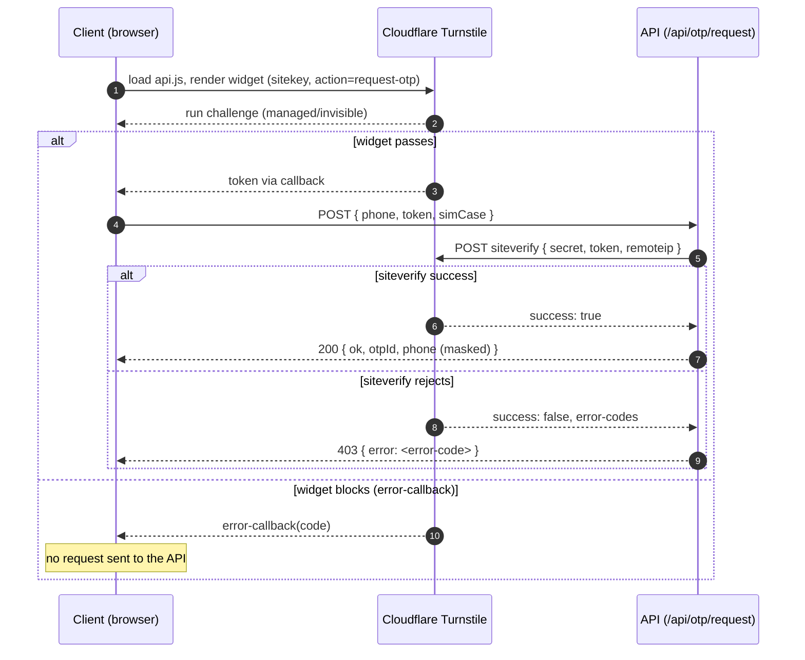

# PoC — Cloudflare Turnstile on an OTP request form


The repo is private, so the badge above only renders for logged-in members of the org.

## Purpose

Cloudflare Turnstile in front of a single-field "request OTP" form, proving —
case by case — that the CAPTCHA, Indonesian phone validation, and KV-backed
rate limiting behave correctly. The site is a showcase for other teams: a
sidebar lists every simulation case and runs it live against the real
Cloudflare siteverify API using Cloudflare's documented test keys.

## What it proves

Deployed: **https://poc-cloudflare-turnstile.pages.dev**

Full design rationale: [`docs/superpowers/specs/2026-09-22-turnstile-otp-poc-design.md`](docs/superpowers/specs/2026-09-22-turnstile-otp-poc-design.md)

| Group      | id               | sitekey / secret           | Expected                                        |
|------------|------------------|-----------------------------|--------------------------------------------------|
| Turnstile  | `pass-visible`   | `1x…AA` / pass              | 200, `{ ok, otpId, phone: masked }`               |
| Turnstile  | `pass-invisible` | `1x…BB` / pass              | 200                                               |
| Turnstile  | `widget-blocks`  | `2x…AB` / pass              | widget `error-callback` fires; no request sent    |
| Turnstile  | `interactive`    | `3x…FF` / pass              | 200 after a human completes the challenge (manual) |
| Turnstile  | `server-rejects` | `1x…AA` / fail              | 403, `invalid-input-response`                     |
| Turnstile  | `token-replay`   | `1x…AA` / spent             | 403, `timeout-or-duplicate`                       |
| Turnstile  | `missing-token`  | `1x…AA`, no token sent      | 400, `missing-token`                              |
| Validation | `invalid-phone`  | `1x…AA` / pass, phone=`12`  | 422, `invalid-phone`; siteverify never called     |
| Rate limit | `per-phone`      | `1x…AA` / pass, ×4          | last request 429, `Retry-After` header            |
| Rate limit | `per-ip`         | `1x…AA` / pass, ×11         | last request 429                                  |
| Production | `real-keys`      | ENV / ENV                   | 200 with real keys (manual, needs a deployment)   |

`src/lib/cases.ts` is the single source of truth — the sidebar, the API's
secret selection, and the Playwright suite all read this same table, so a
case cannot exist without a matching test. `interactive` and `real-keys` are
`manual`: the first needs a human to solve a challenge, the second needs
production Turnstile keys.

## Tech stack and why

| Piece | Why |
|---|---|
| Bun | Single runtime for install, dev server, and unit tests — no separate test runner to configure. |
| SvelteKit (Svelte 5) + `adapter-cloudflare` | One app, one deploy target; the adapter's `platformProxy` gives real KV bindings in local dev with no `wrangler dev` step. |
| shadcn-svelte | Accessible, themeable components (sidebar, card, badge) without hand-rolling a design system for a PoC. |
| Cloudflare Pages | Matches where this is meant to run in front of production traffic. |
| Cloudflare KV | Simplest managed store for rate-limit counters. `get`+`put` is not atomic and is eventually consistent — accepted for a PoC; a Durable Object per key is the upgrade path if this becomes real. |
| Turnstile test sitekeys/secrets | Cloudflare's own documented dummy values produce deterministic pass/fail/replay outcomes, so every case is reproducible without a human solving a real challenge. |
| Playwright, driven from `cases.ts` | One test per case is generated by iterating the same table the UI renders — adding a case adds a test for free. |

## Getting started

```bash
bun install
cp .env.example .env
bun run dev          # http://localhost:5173
```

## Turnstile setup

To use your own keys instead of Cloudflare's test defaults:

1. In the Cloudflare dashboard, go to **Turnstile** and create a widget.
2. Widget mode: **Managed**.
3. Under allowed hostnames, add both your deployed Pages hostname and `localhost`.
4. Copy the sitekey into `PUBLIC_TURNSTILE_SITEKEY` and the secret into
   `TURNSTILE_SECRET_KEY` (locally: `.env`; deployed: see below).

Test keys vs. real keys: the test secrets (`pass`/`fail`/`spent`) only ever
accept Cloudflare's dummy tokens, and a real secret rejects those dummy
tokens outright — so test cases can never accidentally pass or fail against
the wrong secret. Only the `real-keys` case reads from the environment;
every other case pins its own dummy secret directly in `cases.ts`.

## Deploy to Cloudflare Pages

```bash
bunx wrangler login
bunx wrangler pages project create poc-cloudflare-turnstile
bunx wrangler kv namespace create RATE_LIMIT   # paste the id into wrangler.toml
bunx wrangler pages secret put TURNSTILE_SECRET_KEY --project-name poc-cloudflare-turnstile
# PUBLIC_TURNSTILE_SITEKEY and RATE_LIMIT_* live in wrangler.toml's [vars] block,
# not as separate dashboard env vars — that file is the source of truth once
# pages_build_output_dir is set.
bun run deploy
```

The deployed site's `TURNSTILE_SECRET_KEY` is currently set to Cloudflare's
documented always-pass test secret, so every non-`real-keys` case works
against the live URL. `real-keys` stays red until real production keys are
configured (see Turnstile setup above) and the deployed hostname is added to
that widget's allowed domains.

## Testing

```bash
bun run test:unit    # phone normalisation, rate limiter, siteverify client
bun run test:e2e     # one Playwright test per automatable case, single worker
bun run smoke        # curl the non-browser branches of the API
```

`test:e2e` runs with `workers: 1` / `fullyParallel: false`: every case shares
the same origin and source IP, so parallel runs would contend on the per-IP
rate-limit counters and produce false failures.

`BASE_URL=https://poc-cloudflare-turnstile.pages.dev bun run smoke` runs the
same smoke checks against the deployment.

Two cases aren't automated:

- **`interactive`** — open `/?case=interactive`, solve the challenge by hand,
  submit, expect 200.
- **`real-keys`** — needs a real Turnstile key pair configured (see Deploy
  above) and a deployment; open `/?case=real-keys` on the deployed site and
  submit with a valid phone. Real Turnstile widgets reject automated
  browsers (error `600010`, "widget blocked") where the test keys would
  pass — this is correct bot-detection behaviour, not a bug, so this case
  must be run by a human in a normal browser, not from automation.

## Session workflow

This repo is developed across three role-scoped Claude Code sessions
(thinker / planner / executor) with a fixed handoff protocol — see
[`CLAUDE.md`](CLAUDE.md).

## How Turnstile works

1. The browser loads the Turnstile script and renders the widget with the case's sitekey.
2. Cloudflare runs its challenge in the browser and either issues a token via the callback or fires `error-callback` — the client never calls our API without a token.
3. On submit, the browser posts phone + token to `/api/otp/request`.
4. The server calls Cloudflare's `siteverify` with the secret, the token, and the caller's IP.
5. `success: true` lets the request continue into the phone/rate-limit pipeline below; `success: false` returns the first Turnstile error code as a 403.



## How a request is checked

`POST /api/otp/request` runs a fixed pipeline, first failure wins:

1. parse the body and resolve the simulation case — `400 bad-request`
2. normalise and validate the phone (Indonesia only) — `422 invalid-phone`
3. require a Turnstile token — `400 missing-token`
4. verify with Cloudflare siteverify — `403` with the Turnstile error code
5. rate limit per phone, then per IP — `429 rate-limited` with `Retry-After`
6. mock the send and return an `otpId` with the phone masked

Verification runs before rate limiting on purpose: otherwise anyone could
exhaust a victim's phone quota without solving a challenge.

## Known limits

- The rate limiter uses KV `get` + `put`, which is not atomic and is
  eventually consistent — a concurrent burst can let one extra request
  through. Fine for a PoC; a Durable Object per key is the upgrade path.
- KV's `list()` operation (used by the sidebar's per-case reset button) lags
  behind `put`/`delete` more than plain `get` does on real, deployed KV — a
  reset immediately followed by a request can still see the pre-reset count
  for a short window. Local `vite dev` simulates KV with immediate
  consistency, so this only shows up against the real deployment; retrying
  after a few seconds clears it. Same root cause and upgrade path as above.
- OTP delivery is mocked (`console.log`); there is no verification step.
- Token expiry (300 s) is not simulated live — it surfaces as
  `timeout-or-duplicate`, which the `token-replay` case already covers.
- `POST /api/sim/reset` is public and unauthenticated on the live deployment
  — anyone can clear the demo's rate-limit counters (a reset+request loop
  can defeat the rate limiter). Sends are mocked and the reset is scoped to
  `rl:<known-case>:` prefixes, so it can't touch anything outside the demo;
  accepted as fine for a PoC.
- `src/lib/components/ui/sidebar/` is **hand-edited**, not stock shadcn-svelte.
  Below 768px the sidebar renders as an inline panel that starts expanded,
  instead of the generated `Sheet` overlay that starts closed — see
  `docs/superpowers/specs/2026-09-23-sidebar-expandable-design.md`. Three files
  carry the change: `sidebar.svelte` (mobile branch), `context.svelte.ts`
  (`openMobile` default) and `sidebar-provider.svelte` (stacking below `md`).
  Running `bunx shadcn-svelte add sidebar` would overwrite all three and
  silently restore the overlay.
